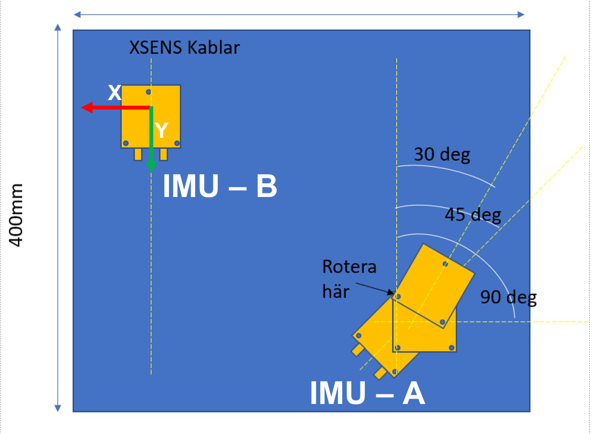

## Multi-IMU calibration

To facilitate testing our concept with the IMU-IMU signal matching we prepared a test board with 2 xsens units with GNSS receiver units for ensuring time sync. The IMUs used have 6-DoF. In our test configuration IMU-B was fixed while we rotated IMU-A at different pre-configured angles ($30^{\circ}$, $45^{\circ}$ and $90^{\circ}$). The sample board, although planar, had some deviations in pitch and roll alignment that we were unable to measure. It can be visualized as follows:

<p align="center">
  
  
</p>

In the example code we have calibrated the 2 IMUs at $90^{\circ}$ configuration. Remaining logs at other configurations are provided [here](logs).

### IMU board preparation
 - We created an IMU board with 2 xsens units.
 - The GT extrinsics were measured with tape.
 - We tried our best to cut a planar sample board. However the board is not plane and there are some roll and pitch misalignments between the 2 IMUs, which we could not measure.
 - Convention used is as described [here](http://paulfurgale.info/news/2014/6/9/representing-robot-pose-the-good-the-bad-and-the-ugly).
 - GT parameters at 45 degree configuration:
    - $\mathbf{t}_{\mathtt{BA}} = [-0.190 m \quad  0.197 m\quad 0m]$
    - $\mathbf{R}_{\mathtt{BA}} = [0^{\circ} \quad 0^{\circ} \quad -45^{\circ}]$ (Format: RPY, The board was non-planar hence there were slight deviations in roll and pitch)

### Data collection procedure
 
The sample logs are collected at 90 degree configuration.

https://github.com/mrsandipandas/imu-calibration/assets/8643655/789ac13b-775d-42e4-b2c3-196e8f018cdd

https://github.com/mrsandipandas/imu-calibration/assets/8643655/f82b77f5-1d4a-45ba-8f5d-7d167d698d0c

### Running instructions on MATLAB
```
test_board_calibration.m
```    

#### IMU calibration


Then we see the results with existing calibration parameters.


#### Observability analysis
Computed Fisher information matrix of batches of size n=100 and got the singular values using SVD. The trajectory selection is done if the minimum singular value exceeds a threshold, which needs to be tuned based on the IMU used and kinematics of the platform. Here we observe that only certain sections of the IMU data has enough excitations needed for calibration.

<p align="center">
  
</p>

